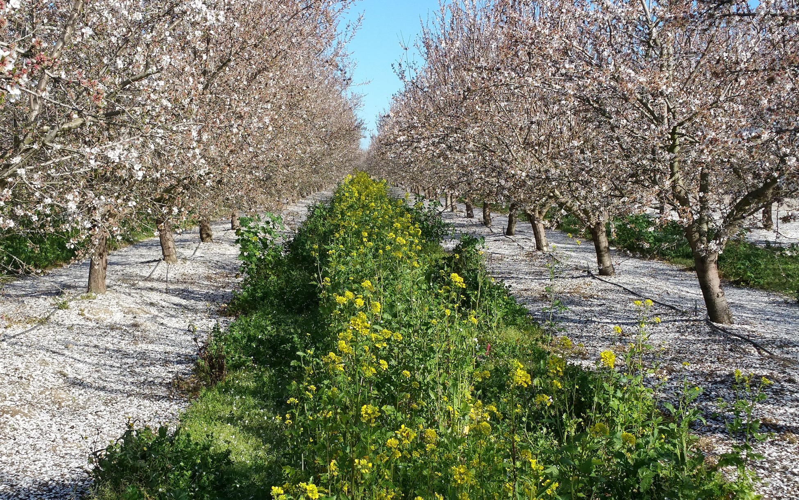
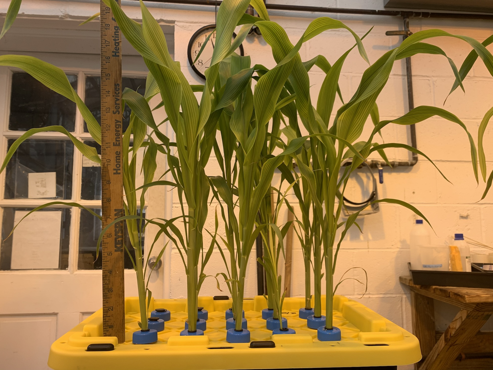

```{r echo=FALSE,message=FALSE, warning=FALSE}
library(ggplot2)
library(emmeans)
library(lme4)
library(lmerTest)
library(multcomp)
library(PLS205)
```

# Instructions

1.  Use the "Visual" markdown version of this document. Click "Visual"
    in the top-left corner of this document before starting.
2.  All necessary packages are loaded in the above code block. Check if
    they all load by clicking the Run arrow
3.  Fill in your answers (R code and text) in each block provided.
    -   Only questions that include an empty code block need R code
    -   All questions need a text answer. Please delete the text "ENTER
        YOUR RESPONSE HERE" and replace with your answer.
4.  When you are done, click the drop-down menu next to "**Preview**"
    and select "**Knit to PDF**". Check the pdf to make sure all R code
    and any associated output is provided.
5.  Upload both the pdf to Gradescope.
6.  This exam is to be done independently. Please do not consult with
    others in the class. You can use any external resource available to
    you. But we will grade based on the material I presented in class.
7.  If you have clarification questions:
    1.  Check Piazza to see if the question has been addressed already
    2.  If not, email the professor or TAs. We will post answers to
        Piazza so that everyone has access to the clarifications. Please
        do not post directly so as not to give away answers to others.
8.  Read every question **completely** and **carefully**! Below the bold
    title-text the notes and instructions are very important to
    answering correctly.

------------------------------------------------------------------------

# Question 1 - part 1



A yield trial was performed at an almond orchard to evaluate different
management treatments for the ground between trees. **3 different ground
covers (Cover)** were evaluated. The orchard was divided into **5 strips
of trees (Strip)**, and then each Strip was divided into **3 sections
(Section)**. Each section of each strip was assigned one of the three
ground cover treatments. The **total yield of almonds (yield, kg)**
harvested from trees in the middle of each section was measured at the
end of the season.

```{r}
almonds = read.csv('almonds_1_field.csv')
str(almonds)
```

## 1.1 Create a design table for this experiment [8 points]

Give a justification for each EU and Block that you specify.

**NOTE:** Right click on a row to insert new rows if needed. You can
also make the table in Excel and paste your table directly here.

| Structure | Variable | Type | \# levels | Block | EU  |
|-----------|----------|------|-----------|-------|-----|
|           |          |      |           |       |     |
|           |          |      |           |       |     |
|           |          |      |           |       |     |

> ENTER YOUR RESPONSE HERE

## 1.2 Write an appropriate linear model for the analysis [4 points]

Be sure to fix any variables in the data table.

```{r}

```

> ENTER YOUR RESPONSE HERE

## 1.3 Can you conclude that any of the ground covers affect yield? Which covers appear best? Worst? [6 points]

Use alpha = 0.05. Show the R output used to answer the question and
reference the specific values you use in your text.

```{r}

```

> ENTER YOUR RESPONSE HERE

# Question 1 - part 2

Given these promising results, you decide to expand the experiment by
adding two additional orchards. You replicate the same design over those
two additional orchards and add them to your data table.

```{r}
almonds_3_Field = read.csv('almonds_3_field.csv',stringsAsFactors = TRUE)
str(almonds_3_Field)
```

## 1.4 Create a new design table for this larger experiment [8 points]

Give a justification for each EU and Block that you specify.

| Structure | Variable | Type | \# levels | Block | EU  |
|-----------|----------|------|-----------|-------|-----|
|           |          |      |           |       |     |
|           |          |      |           |       |     |
|           |          |      |           |       |     |

> ENTER YOUR RESPONSE HERE

## 1.5 Write an appropriate linear model for the analysis [4 points]

Be sure to fix any variables in the data table.

```{r}

```

> ENTER YOUR RESPONSE HERE

## 1.6 Estimate the effects of Cover again, and compare the results of this larger experiment to the first experiment. [6 points]

Have your conclusions changed? You've done 3x the work. Have you gained
precision in your estimates relative to the first (smaller experiment)?
How has the *interpretation* of your treatment effects changed with the
new experiment? Show the effects tables used to answer the question and
reference the specific values you use in your text.

```{r}

```

> ENTER YOUR RESPONSE HERE

# Question 2



An experiment was done to test whether the gene PHOSPHORUS-STARVATION
TOLERANCE1 (SbPSTOL1) affects Sorghum's ability to take up enough
phosphate to maintain root growth under limited phosphate conditions.
**Four independent mutants (`MutA`, `MutB`, `MutC`, and `MutD`)** that
each independently break the gene SbPSTOL1 in different ways were
developed using CRISPR/Cas9 base editing in the r**eference sorghum
genotype `Tx430`**. The experiment used hydroponics, meaning that the
plants were suspended in a liquid medium where specific concentrations
of nutrients could be accurately controlled. Specifically, **10 tubs**
(each 20in x 12 in) were filled with Magnavaca modified nutrient
solution with either **2.5 uM (low-P) or 250 uM (high-P) phosphate**
added as KH2PO4. Plants were germinated on filter paper and then
transferred to plugs in the lid of each bin and grown for three weeks.
**Each tub housed 15 plants, 7 of the reference genotype `Tx430`, and
two each of the four mutants**. The solution was continuously aerated
and changed every 5 days. At the end of the experiment each plant was
removed, the roots excised, dried, and individually weighed and total
dry root mass (g) was recorded for each plant.

```{r}
sorghum = read.csv('sorghum_root.csv')
str(sorghum)
```

## 2.1 Prepare a Design Table for this experiment [8 points]

The focal treatment is `Geno`. Give a justification for each EU and
Block that you specify.

**NOTE:** Right click on a row to insert new rows if needed. You can
also make the table in Excel and paste your table directly here.

| Structure | Variable | Type | N. levels | Block | EU  |
|-----------|----------|------|-----------|-------|-----|
|           |          |      |           |       |     |
|           |          |      |           |       |     |
|           |          |      |           |       |     |

## 2.2 Write an appropriate linear model for the analysis [4 points]

Be sure to fix any variables in the data table. Be careful about nested
terms.

```{r}

```

> ENTER YOUR RESPONSE HERE

## 2.3 Evaluate whether any of the mutants alter root growth in either Phosphorous treatment relative to Tx430. Use $\alpha = 0.05$. Do not use an ANOVA. [6 points]

Show the effects table used to answer the question and reference the
specific values you use in your text.

```{r}

```

> ENTER YOUR RESPONSE HERE

## 2.4 Evaluate which mutant effects on root growth changed in low Phosphorous vs High Phosphorous conditions. Use $\alpha = 0.05$. [6 points]

Show the effects table used to answer the question and reference the
specific values you use in your text.

```{r}

```

> ENTER YOUR RESPONSE HERE

## 2.5 Discuss what the researchers learned about the role of SbPSTOL1 on root growth. [5 points]

Address the following:

1.  You should have found one mutant with a strong effect in both
    conditions, and one mutant with an effect that changed considerably
    between conditions. Which mutant is more interesting for follow-up
    work? Why?
2.  Given that each mutation can alter the genome in other ways in
    addition to "breaking" a gene, and that each mutation breaks the
    gene in different ways, is it reasonable to conclude from this work
    that breaking the gene SpPSTOL1 will affect phosphorous responses in
    all Sorghum varieties? Why or why not? What would you recommend to
    the researchers to gain further evidence that this gene is actually
    involved?

Note: A figure might help you explain your answer to #1.

> ENTER YOUR RESPONSE HERE

```{r}
# OPTIONAL CODE BLOCK
```

## 2.6 Speculate on why the researcher allocated more plants to the Tx430 genotype in each tub than to each of the mutants. Was this a reasonable choice to make? [5 points]

> ENTER YOUR RESPONSE HERE
