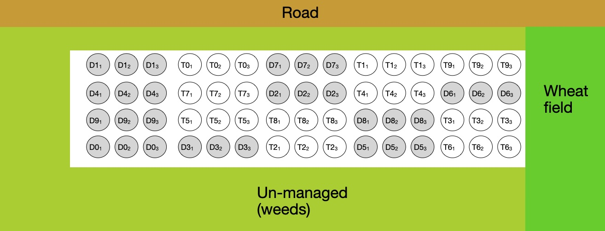
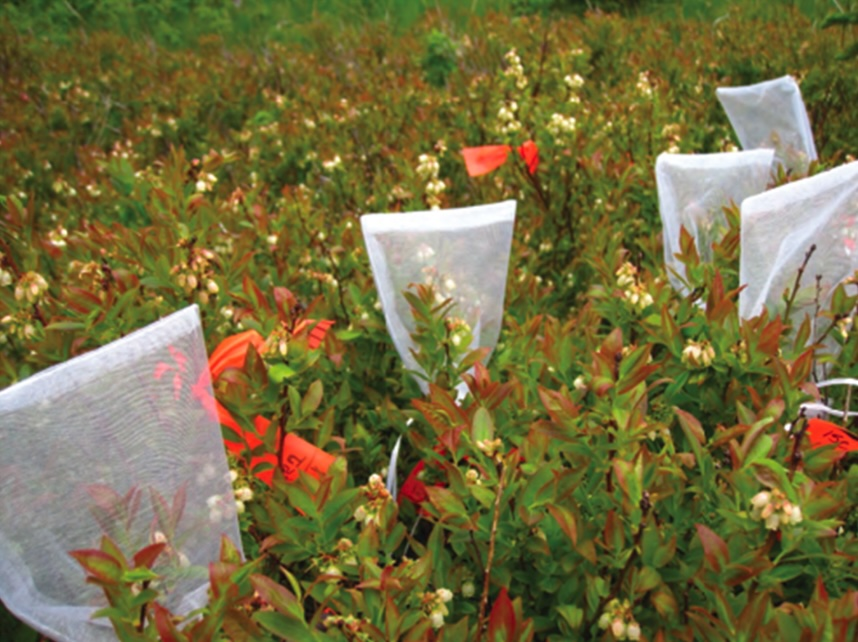

# Instructions

1.  Use the "Visual" markdown version of this document. Click "Visual"
    in the top-left corner of this document before starting.
2.  All necessary packages are loaded in the first code block. Check if
    they all load by clicking the Run arrow
3.  Fill in your answers (R code and text) in each block provided.
    -   Only questions that include an empty code block need R code

    -   All questions need a text answer. Please delete the text "ENTER
        YOUR RESPONSE HERE" and replace with your answer.
4.  When you are done, re-run all your R code chunks by clicking the
    down-arrow next to "Run" in the document's menu bar and selecting
    "Run All". Then click "Preview" and go through each answer to make
    sure the R code and any associated output is provided.
5.  Upload both the Midterm_2024.nb.html and the Midterm_2024.Rmd file
    to Canvas. Do not rename these files. This way we can grade the
    anonymously.
6.  This exam is to be done independently. Please do not consult with
    others in the class. You can use any external resource available to
    you. But we will grade based on the material I presented in class.
7.  If you have clarification questions:
    1.  Check Piazza to see if the question has been addressed already

    2.  If not, email the professor or TAs. **We will post answers to
        Piazza so that everyone has access to the clarifications. Please
        do not post directly so as not to give away answers to others.**
8.  Read every question **completely** and **carefully**! Below the bold
    title-text the notes and instructions are very important to
    answering correctly.

------------------------------------------------------------------------

```{r echo=FALSE,message=FALSE, warning=FALSE}
WITH_CHUNKS = TRUE
library(ggplot2)
library(emmeans)
library(lme4)
library(lmerTest)
library(multcomp)
library(multcompView)
library(PLS205)
```

{width="700"}

# Part 1

Plant genomes are often more tolerant of large-scale chromosomal
changes, such as genome duplications, than animal genomes. An experiment
was run to test the hypothesis that triploid genotypes (3 copies of each
chromosome per cell) of the Midwestern prairie grass species Big
Bluestem (*Andropogon gerardii*) grew faster (produced more biomass)
than diploid genotypes (2 copies of each chromosome per cell). In
genetics, "Diploid" and "Triploid" are levels of ploidy. The
experimenter collected 10 genotypes (each an individual plant at a
unique collection site) of each ploidy from across the species range.
From each genotype, three clonal replicates were created by cutting
stems, inducing root growth, and planting in a randomized position in a
field trial. The cuttings were all approximately the same size and age
at the time of planting. The three clonal replicates were grown in
consecutive plots in the field. See the figure below for the
experimental layout. In the figure, the diploid genotypes are named
D0-D9 and the triploids are labeled T0-T9. Clonal replicates are
numbered 1-3 (e.g. $D3_2$ means the 2nd clone of the "D3" diploid
genotype. At the end of the growing season, all above-ground tissue from
each individual plants was harvested, dried, and individually weighed.
The experimental field was adjacent to a road and a wheat field as
shown, but otherwise surrounded by un-managed fields.

{width="700"}

## 1.1 Critique the experimental design

### 1.1.1 Is the field layout optimal? [10 points]

Is it better to have the clonal replicates adjacent in the field or
randomly distributed? Are there any other issues with how the experiment
was laid out that should have been considered?

> In my opinion, a fully random distribution would be more appropriate.
> If there are aspects of the field that affect biomass production,
> placing clonal replicates adjacent to each other would intuitively
> make it more likely for all of them to be confounded at once. A fully
> randomized placement would lower the chance that a rogue patch of
> field that is better at growing plants makes a certain genotype
> over-perform.
>
> I'm also not a huge fan of this experiment's scope being limited to
> solely ploidy when using 10 separate, independent genomes for each. It
> is not a reasonable assumption to estimate the effect on biomass
> production solely on ploidy; it is undeniable that an individual's
> genotype, epigenetic and environmental factors also contribute to its
> phenotypic response, and those are not factors that would have been
> accounted for in the current experimental design. The environment the
> genotypes were found in could be just as culpable as their genetic
> makeup, and a gene expressed in some or one of the genotypes that
> increases biomass could cause us to overestimate or underestimate the
> effect ploidy has on biomass production. Furthermore, quantitative
> traits like biomass tend to be complex traits: not controlled by any
> one single locus or gene. Testing dosage dependence (i.e. the effect
> of ploidy) on biomass production would also require identifying
> candidate loci that are uniformly present in every genome (meaning
> they would all have to be similarly hetero or homozygotic, which is
> another place where dosage dependence can affect phenotype). If, for
> example, the majority of loci involved in biomass production were
> homozygous in diploid genomes and had two copies out of the three in
> the triploid genomes, there is a real chance that there would be no
> discernible difference between them.

### 1.1.2 What criteria determine whether it is worth including clonal replicates of each genotype? [10 points]

Here is some guidance: i) The act of clonal generation is relatively
easy and quick, ii) Finding more genotypes is challenging. It requires
lots of driving and expensive assays to measure ploidy. It is not
feasible to get more genotypes. iii) Field costs are high (adding more
plots is expensive), but doing more field seasons is much more costly
than one large field season. You do not need to give a quantitative
answer, but discuss the factors that are important to consider

> There's a balance to strike between minimizing cost and maximizing
> sample size and managing the variance of the population. Of course,
> having more genomes for the respective ploidies potentially reduces
> your standard error for your estimation by increasing the sample size.
> However, it will likely also increase your population's variance; it's
> not only necessary to measure ploidy but also at least do some kind of
> genotype assay to ensure there's no genomes that could contribute to
> biomass production independently of ploidy. The more plants you have,
> the more work you have to reduce the chance that anything other than
> the ploidy is contributing to biomass production, in addition to the
> already intensive process of determining ploidy to begin with (likely
> requiring some kind of vizualization with something like DAPI and
> C-banding to isolate cells mid-division and determine chromosome
> counts). Were one of the genomes to have a gene that encourages more
> biomass production, it may cause us to come to the wrong conclusion
> about the effect of ploidy on biomass production by overestimating its
> effect in that strain. The scope of the experiment is solely focused
> on ploidy, so including this would only serve to muddle our
> conclusion.
>
> On the logistics side, as mentioned above, there's only so much
> driving and hunting for individual genomes that can be done before
> real world constraints like "grant deadlines" and "seasons" become an
> issue. But because bigger plots are cheaper than repeating plots
> across time, there's an incentive to maximize the amount you can do at
> one time (also, there's a chance at temporal pseudoreplication if
> multiple field seasons are used, but that would be contingent on
> design). Clonal replicates via plant tissue culture are reasonably
> easy to create, and can be done in a lab before being planted in a
> field in order to standardize the process as much as possible.

### 1.1.3 Is this a *mensurative* or *manipulative* experiment? Does the design match the scope of the research question? [10 points]

Note: Mensurative experiments include both "simple mensurative" and
"comparitive mensurative" experiments

> This is a comparitive mensurative experiment: one that seeks to
> compare measurements of otherwise unmodified experimental units, and
> lacks any manipulation of any kind of condition for a manipulative
> experiment.
>
> The design falls short of the scope, in my opinion. 10 unique genomes
> for each ploidy introduces too many points of confusion for me to
> consider it appropriate. Any number of things could contribute to
> biomass production, and there's no way in the experiment design to
> *ensure* that the effect is solely due to ploidy. This is a case where
> a manipulative experiment would be more appropriate, in my opinion.
> That would be the only way to isolate ploidy as the source of any
> effect, by ensuring that the different experimental units are
> otherwise identical. Otherwise, extensive, expensive genetic screens
> would be necessary to ensure that the different genomes are similar
> enough to compare.
>
> A manipulative experiment would require more steps but may not be that
> unattainable; I would start with a candidate gene study running a GWAS
> for height in a group of similar individuals (i.e. just diploid or
> triploid), then from there see if instead of full polyploidy, if our
> target organism would instead be tolerant to aneuploidy. Creation of
> aneuploidic strains is much simpler and cheaper than inducing
> polyploidy or reducing ploidy. An *in vitro* or tissue-culture proof
> of concept would not only lend more strength to any conclusion you
> make, but also make you a stronger candidate for funding.

------------------------------------------------------------------------

## 1.2 Analyse data collected from the experiment

Data from the experiment are here:

```{r}
bluestem_data <- read.csv('bluestem.csv')
str(bluestem_data)
```

### 1.2.1 Fill in the Design Table for this experiment [10 points]

Provide an explanation for your choice of **Experimental Unit** and
**Replication** for the treatment

| Structure | Variable       | Type        | \# levels | Experimental Unit | Replication |
|------------|----------------|------------|------------|------------|------------|
| Treatment | Ploidy         | Categorical | 2         | Genotype          | None        |
| Design    | Genotype       | Categorical | 20        |                   |             |
|           | Clone          | Categorical | 3         |                   |             |
|           | Genotype:Clone | Categorical | 60        |                   |             |
| Response  | Biomass        | Numeric     | 60        |                   |             |

> I chose genotype as the experimental unit, it was the best choice
> given that each corresponded to a single treatment level (i.e. diploid
> or triploid). I considered the clones, but ultimately decided that
> they were more appropriately described as subsamples, given that they
> were copies of a single genotype and therefore

### 1.2.2 Do any columns of `bluestem_data` need to be changed or added to be consistent with the design table? [5 points]

Make any necessary changes here:

```{r}
bluestem_data$Clone = as.factor(bluestem_data$Clone)
```

> Sure do! Every column of the data save `Biomass` are categorical and
> need to be either `chr` or `factor`, and since `Clone` is not, I will
> convert it to `factor`.

### 1.2.3 Write the linear model for this experiment using the R function `lm()` or `lmer()` as appropriate: [5 points]

Explain why you chose `lm()` or `lmer()`

```{r}
biomod <- lmer(Biomass ~ Ploidy + (1|Genotype) + Clone, data = bluestem_data)
```

> I'm going to use lmer here, since there is some randomness that each
> subsample clone can contribute to effect (i.e., given three clones
> with no other differences, there could still be different estimations
> of effects due to randomness).

### 1.2.4 Make the model diagnostic plots shown in lab. Is there reason to be concerned about any of the model assumptions? [5 points]

```{r}
pls205_diagnostics(biomod)
```

> Our normality assumption looks good, and the variances are relatively
> similar to each other, though there are a few that are higher than the
> others. This might be a place to be concerned, but otherwise we're in
> the clear.

### 1.2.5 Use the `emmeans()` and `contrast()` functions to perform a Hypothesis test against the null hypothesis that the Ploidy had no effect on biomass. [10 points]

Report the result of this test as if you were writing a paper in a
journal that requests you use $\alpha = 0.05$.

```{r}
biomeans <- emmeans(biomod, spec = 'Ploidy')
diffmeans <- contrast(biomeans,'pairwise')
diffsummary = summary(diffmeans, level = 0.95, infer = c(F,T))
print(diffsummary)
```

> Our estimate of ploidy appears to be significant at a = 0.05, causing
> us to reject the null hypothesis that the estimate of its effect is 0.

------------------------------------------------------------------------

{width="500"}

# Part 2

An experiment was run to test whether diurnal or nocturnal pollination
is more important for fruit set in lowbush blueberries. A large patch of
lowbush blueberries was selected at the end of May and 30 branches with
unopened flowers were identified, with only a single branch selected per
individual bush. Each branch was randomly allocated to one of 5
treatments:

1.  No pollinators: Left continually bagged (no pollinator access)
2.  Diurnal pollinators: bagged to exclude pollinators during nighttime
    hours
3.  Nocturnal pollination: bagged to exclude pollinators during during
    daytime hours
4.  No bag treatment: continuous pollinator access
5.  Sham treatment: bags placed and immediately removed once daily to
    stimulate experimental flower manipulation during treatments 2 and 3

Each branch was monitored until fruits had been set, and then they
measured the percentage of flower buds that set fruit per branch.

The researchers presented the following summarized data:

|                              | **No pollinators** | Diurnal pollinators | Nocturnal pollinators | No bags | Sham |
|------------|------------|------------|------------|----------|------------|
| Num reps: $n_i$              | 6                  | 6                   | 6                     | 6       | 6    |
| Sample mean (%): $\hat\mu_i$ | 20                 | 52                  | 33                    | 58      | 48   |
| Sample SD: $\sqrt{s^2_i}$    | 4.1                | 5.3                 | 3.7                   | 7       | 6.3  |

### 2.1 Is this a Direct or Indirect experiment? [5 points]

Explain your answer

> Indirect. This involves the measurement of a few different means, but
> each EU is only subjected to a single treatment level. It's possible
> to directly estimate the means of each EU, and with those we will
> indirectly estimate the difference, delta-hat. (I.E. mu-A - mu-B and
> so on)

### 2.2 Estimate the maximum effect of the pollinator exclusion bags on fruit set. Provide a 95% confidence interval around this estimate. [10 points]

Choose which comparisons are relevant to this question and use those to
choose an appropriate critical value from the table below. You might not
need to compare all the five treatments to answer the question.

| Distribution | DF = 10 | DF = 15 | DF = 20 | DF = 25 |
|--------------|---------|---------|---------|---------|
| T            | 2.23    | 2.13    | 2.09    | 2.06    |
| Dunnet(3)    | 2.76    | 2.63    | 2.56    | 2.52    |
| Tukey(4)     | 3.06    | 2.88    | 2.8     | 2.75    |
| Tukey(5)     | 3.29    | 3.09    | 2.99    | 2.94    |

```{r}
tcrit = 2.94 #using Tukey(5)
ncmean = 58
dmean = 52
nmean = 33
shmean = 48
nomean = 20
dest = ncmean - dmean
nest = ncmean - nmean
shest = ncmean - shmean
noest = ncmean - nomean
maxest = max(dest, nest, shest) #max is nocturnal only - no bag.
maxest
sedmax = 7 / sqrt(6) + 3.7 / sqrt(6)
ciupper = maxest + (tcrit * sedmax)
cilower = maxest - (tcrit * sedmax)
ciupper
cilower
```

> I'm opting to use the Tukey distribution. The goal is to find the
> maximum effect of bagging. That is in essence a "pairwise" comparison,
> since without comparing two bagging schema it is impossible to
> determine what the 'maximum' is. Two schema could indeed be different
> than the control as per the Dunnett distribution, but in the Dunnett
> distribution we cannot directly compare the treatments. With that in
> mind, I'm going to compare all of the treatment levels to the "No Bag"
> level, which is the negative control. The values other than Diurnal
> and Nocturnal are controls/sanity checks, and important to verify that
> the design functions to answer this question. However, the negative
> and positive controls will not be candidates for "maximum effect".
>
> My degrees of freedom will eqpual 25 in this case, 5\*(6-1), since I
> will be comparing all treatments to each other, which makes my t-crit
> 2.94.
>
> My estimated effect is -25%, with a confidence interval of -12.2% to
> -37.8%

### 2.3 Since the researcher's stated goal was to compare fruit set between the diurnal and nocturnal treatments, would they have been better off allocating 9 branches to those two treatments and only 4 to the others? [10 points]

What comparisons would have had smaller TRUE standard errors? Which
comparisons would have had larger TRUE standard errors? How much
smaller/larger?

```{r}
1/sqrt(4) - 1/sqrt(6)
1/sqrt(9) - 1/sqrt(6)
```

> Assuming that the variances of population and measurement didn't
> change (which they shouldn't for true values, the standard errors of
> all treatments with n = 4 would be larger, and all treatments with n =
> 9 would be smaller. The square root of 6 is 2.45, so the n = 4
> standard errors would increase by 9.1%, and the n = 9 standard errors
> would decrease by 7.5%

### 2.4 Speculate on WHY the researchers included treatments \#'s 1, 4, and 5 in this experiment. [10 points]

-   Explain what they would conclude if they observed fruit set wasn't
    much lower in #1 than #4. Would this change the interpretation of
    the effect diurnal vs nocturnal pollinator exclusion?

-   Explain what they would conclude if they observed that fruit set was
    much lower in #5 than #4. Would this change the interpretation of
    the effect diurnal vs nocturnal pollinator exclusion?

> Treatments 1, 4, and 5 are present as controls. They are there to
> ensure that any changes that can be observed are the result of their
> experiment and not outside factors. If the fruit set wasn't much lower
> in #1 than #4, it would cast into question the efficacy of the bags in
> preventing pollination. Any difference in diurnal vs nocturnal
> exclusion would be difficult to attribute to isolation via a bag that
> is otherwise faulty.
>
> If the fruit set in 5 was much lower than 4, then the mere act of
> placing a bag on a branch could be reducing the fruit set. This, too,
> would effect the interpretation of diurnal vs nocturnal pollinator
> exclusion, because it would cast into doubt that the reduction was due
> to exclusion and not the physical manipulation on the branch by the
> bag itself.
