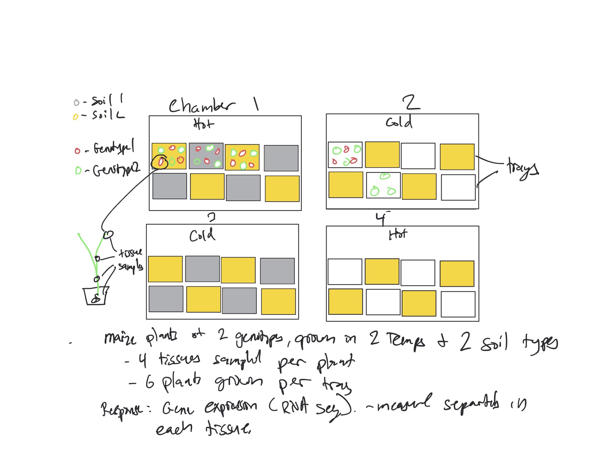

Use this R Notebook document to answer the questions and document your work.
Enter the R code used to answer each question in the corresponding R code chunk.
Write any textual explanations **outside** of the chunks.
Attempt to clean up your code as much as possible so that only the necessary lines remain.

When you are done:

1.  Select 'Run All' from the 'Run' dropdown menu.
2.  Save (File -\> Save)
3.  Click 'Preview' to bring up the `HW1.nb.html` file. Check through this to make sure it rendered correctly.
4.  Upload the files: `HW1.nb.html` and `HW1.Rmd` to Canvas.

------------------------------------------------------------------------

# Part 1

1.  Read **Hurlbert 1984** up to the section "Interspersion of treatments" .
2.  Select a paper reporting the results of an experiment.

-   Choose a paper from **your field** reporting on an experiment relevant to your own research.

-   A good choice might be a recent paper from your own lab (by your PI or previous grad students or postdocs) or from your own research.

-   If you cannot find a paper, come to the TAs or Professor Runcie for suggestions.

    > ENTER THE CITATION AND URL HERE

2.  Choose a single experiment from this paper.

-   Many papers report the results of many individual experiments.
    Choose only one of these.

-   Many papers report on many outcomes from the same experiment (e.g. different response variables).
    Choose one

-   You should have access to the numeric results of the analysis of the experiment (p-values, F-statistics, confidence intervals, effect estimates), and ideally even the raw data.
    If results are presented in a figure, you can try to extract these results using a digitization tools like: <https://plotdigitizer.com/>.
    You don't need to do this yet, but may choose to for the final at the end of the quarter.

-   Briefly describe the experiment.
    Using the terminology of **Hurlbert 1984**, address:

    -   Is this a mensurative or manipulative experiment?

    -   What was the experimental objective?

    -   How were **sources of confusion (Table 1)** controlled?

    -   What were the results

    -   Aim for 1-2 paragraphs.
        This doesn't need to be long

    > ENTER YOUR RESPONSE HERE

3.  Draw a diagram of the experiment.

-   Label the diagram using the terms we discussed in the first class (Treatment, Experimental Unit, Blocks, Response)

-   Try to show the overall structure of how the experiment was laid out.

The goal of this is to get you thinking about the issues in experimental design, and to help me understand the range of questions students are studying.

To upload your diagram, save it as a file (jpeg, png, etc, but not pdf) in the directory of this .Rmd file.
Then use the FIGURE/IMAGE button in the toolbar to insert your image.

Here's an example:



**Note:** You can use PowerPoint or a drawing tool to create the diagram on your computer, or you can draw on paper, take a picture with your phone, and then download that file into the folder with this HW1.Rmd file, and change the file name above to the file name of your picture.
Using the **Visual** format (click the `Visual` button on the top-left of this window), click on the image icon to import and image.

------------------------------------------------------------------------

# Part 2 - R practice

In lab, we ran simulations of an experiment to measure the average length of fish in a pond.

Here, you will do a similar exercise except this time we will also simulate an **experimental manipulation**, (i.e. a treatment) and you will study the treatment's **effect**.

We'll use the example of measuring pulses of people in class with a treatment of sitting vs standing.
But this time we'll "measure" each person's pulse both sitting and standing.

For the purposes of this simulation, I'll state that the TRUE values for the relevant population parameters are the following:

-   The average pulse of someone sitting is 70bpm

-   The standard deviation of pulses among sitting people is 10bpm

-   The average **effect** of standing is 10bpm

-   The standard deviation of standing effects is 3bpm

## Simulate 1 person

Here is the outline of code to simulate the measurements for one person.
Fill in the appropriate values by replacing the `___` with numbers.

```{r}
ave_sitting = ___
sd_sitting = ___
ave_standing_effect = ___
sd_standing_effect = ___

sitting_pulse = rnorm(n=1,mean = ave_sitting, sd = sd_sitting)
sitting_pulse

standing_effect = rnorm(n=1,mean = ave_standing_effect, sd = sd_standing_effect)
standing_pulse = sitting_pulse + standing_effect
standing_pulse
```

> Enter the sitting pulse, standing pulse, and standing effect.
> Include units.

As an experimenter, it is impossible to **directly observe** the *effect of standing* for this person.
All you could observe is `sitting_pulse` and `standing_pulse`.
Show that you can calculate the standing effect for this person from these two values (replace `___` with R code):

```{r}
calculated_standing_effect = ___
calculated_standing_effect
```

> Do you get the same value as above?

## Simulate an experiment involving 40 people

Here is the outline of code to simulate the measurements of standing effects for 40 people.
It uses a **for loop** like in lab.
Fill in the calculation needed (replace `___` with code) and run the code.
**Estimate the average standing effect.**

```{r}
# leave this code here so the simulation is repeatable
set.seed(1)

# start of your code:
n_people = 40
observed_standing_effects = rep(NA,times = n_people)

for(person in 1:n_people) {
  sitting_pulse = rnorm(n=1,mean = ave_sitting, sd = sd_sitting)
  standing_effect = rnorm(n=1,mean = ave_standing_effect, sd = sd_standing_effect)
  standing_pulse = sitting_pulse + standing_effect
  
  calculated_standing_effect = ___
  observed_standing_effects[person] = calculated_standing_effect
}

```

> Enter your answer here.
> Include units

## What is the TRUE error in this estimate?

Use the vector `observed_standing_effects` above, to calculate how much your estimate missed the true value.

```{r}
# Enter your code here
```

> Enter your answers here.
> Include units.

## Calculate the TRUE standard error based on this experimental design and the TRUE population parameters above

```{r}
# Enter your code here
```

> Enter your answers here.
> Include units.

## Simulation 100 replicate experiments with the same size and parameters above, and record the estimated standing effect from each experiment

The following code takes the single experiment with 40 people above, and uses a **second for loop** to repeat it 100 times.
Fill in the code from your answers above to complete so that it estimates the treatment effect for each person, and then calculates the average observed treatment effect.

Calculate the **mean** and **standard deviation** of the treatment effect estimates across the 100 experiments.
Compare these values to the values that you expect.

```{r}
set.seed(1)

n_experiments = 100
replicate_estimates = rep(NA,times = n_experiments)

for(expt in 1:100) {
  # code for each individual experiment:
  n_people = 40
  observed_standing_effects = rep(NA,times = n_people)
  
  for(person in 1:n_people) {
    sitting_pulse = rnorm(n=1,mean = ave_sitting, sd = sd_sitting)
    standing_effect = rnorm(n=1,mean = ave_standing_effect, sd = sd_standing_effect)
    standing_pulse = sitting_pulse + standing_effect
    
    calculated_standing_effect = ___
    observed_standing_effects[person] = calculated_standing_effect
  }
  
  # calculate the estimated mean treatment effect for this experiment
  current_experiment_estimate = ___
  
  # save that estimate in the vector of results
  replicate_estimates[expt] = current_experiment_estimate
}


```

> Enter your answers here.
> Include units.

## Compare to an experiment that measured DIFFERENT PEOPLE for the two treatments

The following code modifies the experimental design to be more similar to what we did in class.
We select 40 people to observe sitting, and 40 DIFFERENT people to observe standing.
We calculate the average pulses of the people sitting, and the average pulses of the people standing.
We then take the difference between these two as our estimate of the standing effect.
This **full experiment** is replicated 100 times so that we can compare it's efficiency to the previous experiment.

Report the **mean** and **standard deviation** of the treatment effect estimates across the 100 experiments.
Compare these values to the previous experimental design above

```{r}
set.seed(1)

n_experiments = 100
replicate_estimates = rep(NA,times = n_experiments)

for(expt in 1:100) {
  # code for each individual experiment:
  
  # first observe 40 people sitting
  n_people = 40
  observed_sitting_pulses = rep(NA,times = n_people)
  
  for(person in 1:n_people) {
    sitting_pulse = rnorm(n=1,mean = ave_sitting, sd = sd_sitting)
    observed_sitting_pulses[person] = sitting_pulse
  }
  
  # Then observe 40 people standing
  n_people = 40
  observed_standing_pulses = rep(NA,times = n_people)
  
  for(person in 1:n_people) {
    sitting_pulse = rnorm(n=1,mean = ave_sitting, sd = sd_sitting)
    standing_effect = rnorm(n=1,mean = ave_standing_effect, sd = sd_standing_effect)
    standing_pulse = sitting_pulse + standing_effect
    observed_standing_pulses[person] = standing_pulse
  }
  
  # Then calculate the two averages
  average_sitting_pulse = mean(observed_sitting_pulses)
  average_standing_pulse = mean(observed_standing_pulses)
  
  # Then get our estimate of the standing effect
  current_experiment_estimate = average_standing_pulse - average_sitting_pulse
  
  # save that estimate in the vector of results
  replicate_estimates[expt] = current_experiment_estimate
}


```

> Enter your answers here.
> Include units.

## Discuss experimental design issues that might impact the VALIDITY of the two designs

Focus on issues that might affect the scientific interpretation of the results.

> Enter your response here
